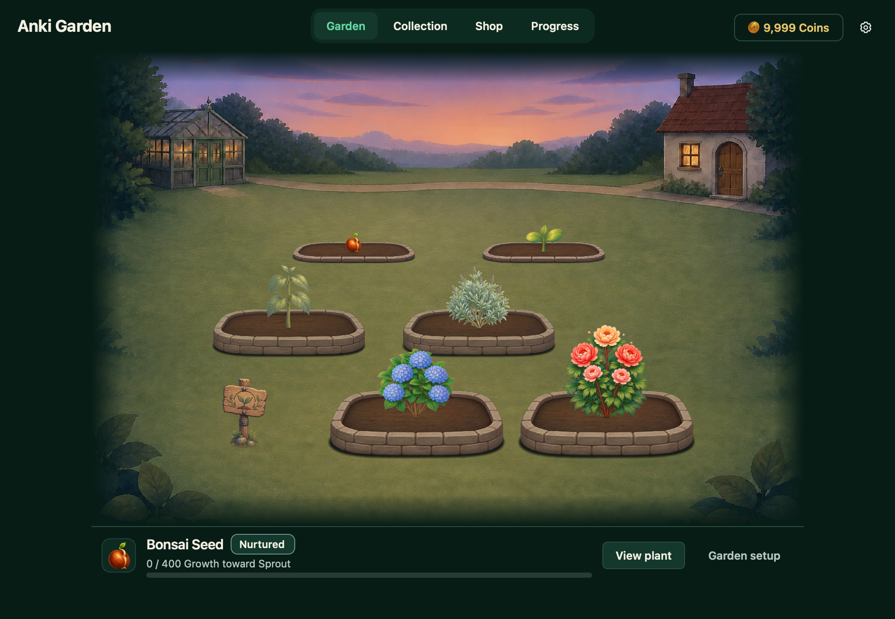

# Anki Garden 🌿

Turn your Anki study sessions into a growing, hand-painted garden. Choose a plant, complete cards, and earn new plants, scenery, and decorations as you go.

**Anki Garden 2.2.0 — unreleased candidate** · [What’s new](docs/release-notes-2.2.0.md)

Release is on hold while the progression pacing guardrail is resolved. The combined changes are available for development and UI review; they are not approved for public distribution. See the [integration report](docs/ui/combined-integration-20260906.md).

The [September 6 UI review](docs/ui/comprehensive-ui-review-20260906.md) includes five fresh contact sheets covering all 50 native surfaces at 100% scale. This pass improves text fit, contrast, compact layouts, accessible controls, reward consistency, and plant artwork placement.

## Get started

1. Install `anki_garden.ankiaddon` through Anki’s **Tools → Add-ons → Install from file**, then restart Anki.
2. Choose **Choose a plant** on Anki’s home screen. After setup, this becomes **Open garden**.
3. Pick a free starter and choose its garden bed.
4. Choose **Nurture** in the plant’s panel to start growing it.
5. Study as usual. Your nurtured plant gains Growth as you complete cards.

Bonsai, Rose, Sunflower, and Lavender are the free starter choices. All plants grow at the same rate. Plants are identified by their growth stage and species. You can rename your garden in Settings.

## Find your way around

| Tab | What you can do |
|---|---|
| **Garden** | See your plants, choose which one to nurture, move plants, and use supplies. |
| **Collection** | Browse your plants, compare bonuses, change your garden’s appearance. |
| **Shop** | Spend Coins on plants, supplies, scenery, and decorations. |
| **Progress** | See today’s cards, your Anki streak, achievements, and Coin activity. |

Click a plant to see its progress and actions. **Nurture** chooses the plant that receives your future Growth. Viewing or moving another plant does not change the plant you nurture.

## Make the garden yours

Collection has two areas: **Plants** and **Appearance**. Select a species to see its current plant, growth stages, history, and actions in one panel. In Appearance, Scenery and Decorations share one garden preview; select an item to see its complete effect.

- Selecting an item previews it. **Equip** saves its artwork and bonus together; **Cancel preview** returns to your saved equipment.
- **Equipped** shows your saved scenery and decoration with their effects. **Undo** restores your previous equipment.

Previewing an item does not spend Coins, use supplies, or save changes. Cosmetic decorations have no study bonus. Purchases add items to your collection; choose **Equip** to use them.

## Growth and rewards

**Growth** advances a plant through Seed, Sprout, Young, Mature, Flowering, and Full Bloom. Completed cards give the nurtured plant 10 base Growth, with extra Growth from active bonuses. Other planted plants also receive a share. Again, Hard, Good, and Easy give the same ordinary Growth.

**Coins** buy plants and supplies and help complete garden projects. Earn them from studying, completing today’s cards, streaks, achievements, plant milestones, and Garden Finds.

**Garden Rhythm** adds up to 10% Growth based on recent days when you completed today’s cards. Your **Anki streak** tracks consecutive days of study and gives Coin rewards.

**Garden Finds** can bring Coins, Growth, and useful supplies, with no daily Find limit. **Garden discoveries** add new scenery and decorations to your collection. Rare finds use gold accents, Very Rare finds use lavender, and Exceptional and Ultra Rare discoveries use pink pearl accents consistently across reward panels.

Your first two garden beds are included. More beds unlock as your plants reach Mature and as more plant types reach Full Bloom. New plant types in the Shop cost 250 Coins.

## While you study

The review panel shows your nurtured plant and progress toward its next stage. **This session** keeps Coins, Growth, and Discoveries together below the plant, followed by your recent rewards. Today’s card totals remain in **Progress → Today**.

Collapse the panel to a narrow vertical strip while studying. Milestones, discoveries, Coins, and Growth appear below the plant circle, one at a time, with the most significant rewards first. Notable rewards briefly pulse in their rarity color; the glow clears while the reward stays readable.

Session summaries and sync receipts share the same three totals boxes, discovery artwork, rarity badges, and reward cards. Session reward details stay visible; sync receipts can expand for additional details. **Discoveries** counts Garden Finds and newly unlocked scenery or decorations once each. Each summary covers its own session or sync batch.

## Supplies

| Supply | Effect |
|---|---|
| **Basic Fertilizer** | +1 Growth per card for 100 cards · 30 Coins |
| **Quality Fertilizer** | +2 Growth per card for 200 cards · 100 Coins |
| **Magical Fertilizer** | +3 Growth per card for 400 cards · 300 Coins |
| **Booster Potion** | +5 Growth per card for 100 cards · found as a reward |
| **Small Growth Charge** | +100 Growth when used · 30 Coins |
| **Standard Growth Charge** | +500 Growth when used · 125 Coins |
| **Grand Growth Charge** | +2,000 Growth when used · earned through rewards |

Fertilizer and Potions last for cards, not time. Owning Herbalist’s Hourglass or Full Moon Garden adds 25 cards to new Potions for each, up to 150 cards when you own both. The menu shows whether a dose starts now, extends an active supply, or waits its turn. Growth Charges normally target a planted, unfinished plant. Once all species reach Full Bloom, charges follow the garden’s Growth route into your selected Mastery project or Stored Growth. The confirmation shows where the Growth will go, any stage changes, and the charges left after use. The matching receipt shows the result and offers **View plant** when a plant was affected.

## Stored Growth

After your plants receive their Growth, any overflow is saved as **Stored Growth** unless you have selected a Cultivation Mastery project. Reaching Full Bloom never discards earned Growth.

For **Cultivation Mastery**, choose a Full Bloom species and let overflow fund its next appearance. You can also contribute Stored Growth. **Unlock appearance** shows the Coin cost and becomes available when the rank is funded and affordable; Coins are spent only when you choose it.

## Settings and help

Use the gear in the Garden to rename it, reduce animations, and choose which Garden panels and reward notices appear in Anki. **Artwork check** helps identify missing artwork.

If you study on another device, syncing back to desktop can show a summary of the garden rewards you earned. Turning off that summary does not turn off the rewards.

Your garden is retained when the add-on is upgraded. If no unfinished plant is available, Growth is redirected or saved rather than lost.

For more detail, see the [progression and rewards guide](docs/progression-rewards-effects-reference.md). Developers can use the [development guide](docs/development.md).
