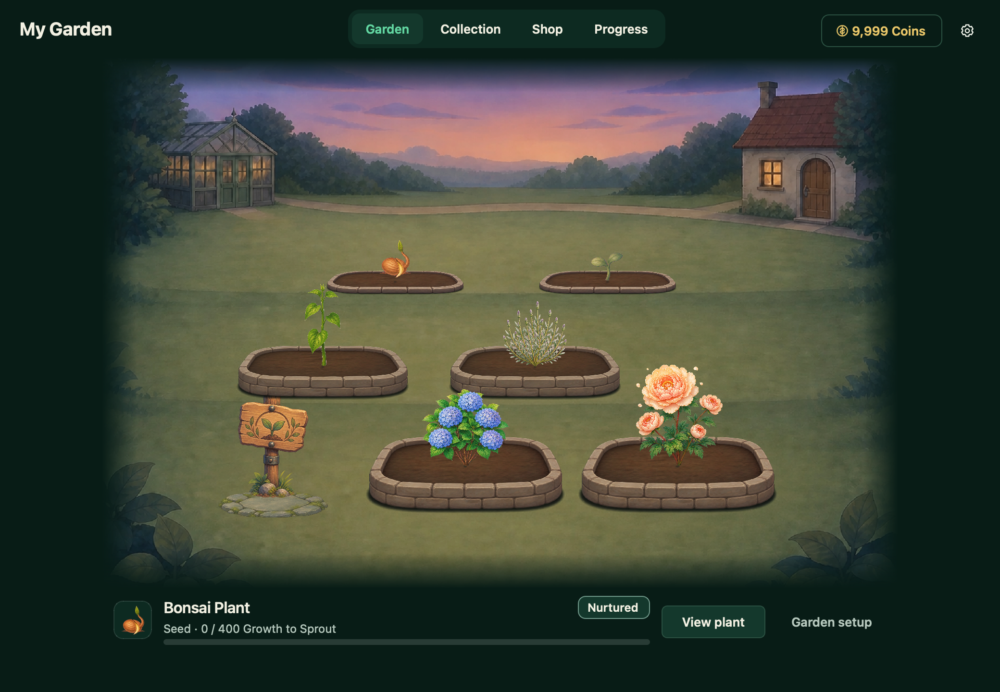

# Anki Garden 🌿

Turn your Anki study sessions into a growing, hand-painted garden. Choose a plant, complete cards, and earn new plants, scenery, decorations, and garden landmarks as you go.

**Anki Garden 2.2.0** · [What’s new](docs/release-notes-2.2.0.md)

## Get started

1. Install `anki_garden.ankiaddon` through Anki’s **Tools → Add-ons → Install from file**, then restart Anki.
2. Choose **Choose a plant** on Anki’s home screen. After setup, this becomes **Open garden**.
3. Pick a free starter and choose its garden bed.
4. Study as usual. Your nurtured plant gains Growth as you complete cards.

Bonsai, Rose, Sunflower, and Lavender are the free starter choices. All plants grow at the same rate. You can rename your garden in Settings and rename individual plants in Plant details.

## Find your way around

| Tab | What you can do |
|---|---|
| **Garden** | See your plants, choose which one to nurture, move plants, and use supplies. |
| **Collection** | Browse your plants, compare bonuses, change your garden’s appearance, and build Landmarks. |
| **Shop** | Spend Coins on plants, supplies, scenery, and decorations. |
| **Progress** | See today’s cards, your Anki streak, achievements, and Coin activity. |

Click a plant to see its progress and actions. **Nurture** chooses the plant that receives your future Growth. Viewing or moving another plant does not change the plant you nurture.

## Make the garden yours

Scenery, Decorations, and Landmarks share one garden preview in Collection. Each browsing tile shows a short bonus summary; select it for the full details.

- **Use appearance** applies the previewed artwork. Undo can restore the previous appearance.
- **Use bonus today** selects a bonus before today’s bonuses are set. After that, **Schedule bonus** changes the bonus at the displayed date and time.
- **In your garden** shows your current scenery, decoration, and Landmark, plus the source of today’s bonuses.
- **Show artwork** only changes visibility. Hiding an item keeps its bonus active.
- **Scheduled bonuses** shows upcoming changes and lets you cancel them individually.
- **Other active bonuses** shows Fertilizer, Booster Potions, and Garden Rhythm, including the affected plant and remaining cards.

Appearance and bonuses can come from different items. Previewing an item does not spend Coins, use supplies, or save changes.

## Growth and rewards

**Growth** advances a plant through Seed, Sprout, Young, Mature, Flowering, and Full Bloom. Completed cards give the nurtured plant 10 base Growth, with extra Growth from active bonuses. Other planted plants also receive a share. Again, Hard, Good, and Easy give the same ordinary Growth.

**Coins** buy plants and supplies and help complete garden projects. Earn them from studying, completing today’s cards, streaks, achievements, plant milestones, and Garden Finds.

**Garden Rhythm** adds up to 10% Growth based on recent days when you completed today’s cards. Your **Anki streak** tracks consecutive days of study and gives Coin rewards.

**Garden Finds** can bring Coins, Growth, and useful supplies. **Garden discoveries** add new scenery and decorations to your collection.

Your first two garden beds are included. More beds unlock as your plants reach Mature and as more plant types reach Full Bloom. New plant types in the Shop cost 250 Coins.

## Supplies

| Supply | Effect |
|---|---|
| **Basic Fertilizer** | +1 Growth per card for 100 cards · 30 Coins |
| **Quality Fertilizer** | +2 Growth per card for 200 cards · 100 Coins |
| **Magical Fertilizer** | +3 Growth per card for 400 cards · 300 Coins |
| **Booster Potion** | +5 Growth per card for 100 cards · found as a reward |
| **Small Growth Charge** | +100 Growth when used · 30 Coins |
| **Standard Growth Charge** | +500 Growth when used · 125 Coins |
| **Grand Growth Charge** | +2,000 Growth when used · earned through rewards |

Fertilizer and Potions last for cards, not time. The menu shows whether a dose starts now, extends an active supply, or waits its turn. Growth Charges apply to one planted, unfinished plant. The confirmation shows the exact effect before you use one.

## Landmarks and longer-term goals

After your first Full Bloom, you can build six Landmarks using **Stored Growth** and Coins. Stored Growth is Growth saved for garden projects. Built Landmarks decorate your garden and give no bonus.

The Landmark you display can differ from the one you are growing. Your original plants and earned Growth stay with you as you work toward Landmarks, Cultivation Mastery, and Garden Legacy.

## Settings and help

Use the gear in the Garden to rename it, reduce animations, and choose which Garden panels and reward notices appear in Anki. **Artwork check** helps identify missing artwork.

If you study on another device, syncing back to desktop can show a summary of the garden rewards you earned. Turning off that summary does not turn off the rewards.

Your garden is retained when the add-on is upgraded. If no unfinished plant is available, Growth is redirected or saved rather than lost.

For more detail, see the [progression and rewards guide](docs/progression-rewards-effects-reference.md). Developers can use the [development guide](docs/development.md).
