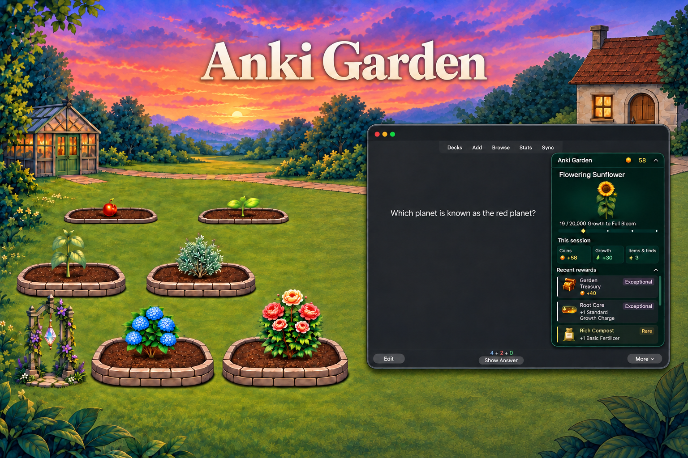
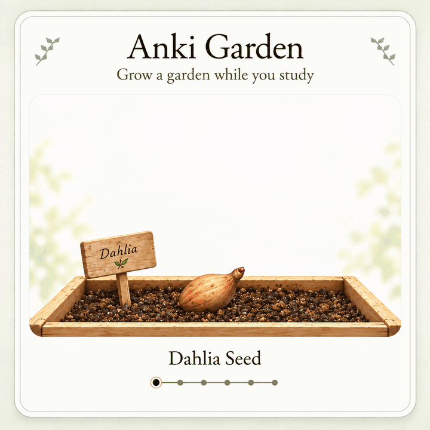

# Anki Garden

**Grow a garden while you study.**

Anki Garden is a free, open-source gamification add-on for desktop Anki. As you answer cards, grow plants, earn Garden Coins, receive random drops, and unlock more of your garden.

**Version 2.2.0** | [Watch the demo](docs/images/anki-garden-demo.mp4) | [Install](#install) | [How it works](#how-it-works) | [Report an issue](https://github.com/caleblee789/Anki-Gardening/issues)

[See what changed in 2.2.0](docs/release-notes-2.2.0.md).

## A little progress while you study

Keep Garden as a small progress tile during reviews, or expand the reviewer panel to see your plant and recent rewards. Open the full garden after a study session to see what grew, check what you earned, and decide what to unlock next.

- Grow ten plant species through six stages, from Seed to Full Bloom, and unlock more garden beds.
- Collect scenery, decorations, supplies, achievements, and Gardening Trophies.
- Earn Garden Coins and random drops as you study; some rare finds unlock powerful rewards.
- Adjust animations, reviewer panels, and reward summaries in Garden settings.

*This showcase demonstrates several reward states, not their typical frequency.*

## Install

**AnkiWeb:** [Install Anki Garden](https://ankiweb.net/shared/info/{{ANKIWEB_CODE}})

**Add-on code:** `{{ANKIWEB_CODE}}`

1. Install with the add-on code and restart Anki.
2. Select **Choose a plant** on Anki's home screen. Your first starter is free.
3. Place it in a bed and choose **Nurture**.
4. Study as usual. Select **Open garden** on Anki's dashboard, or use the reviewer panel, to see your progress.

If installing from a GitHub release instead, use its `.ankiaddon` asset through **Tools → Add-ons → Install from file**. GitHub's source-code ZIP is not the add-on package.

## How it works

**Answer cards to earn Growth.** Hard, Good, and Easy give the same base Growth, so choose the answer that reflects your recall. Plants grow through six stages:

Seed → Sprout → Young → Mature → Flowering → Full Bloom.

<table>
  <tr>
    <td align="center">
      
       
      Dahlia stage showcase.
    </td>
  </tr>
</table>

**Earn Coins and collect items.** Studying, milestones, and Garden Finds award in-game currency and rewards. Spend Coins in the Shop on plants, supplies, scenery, and decorations. Buying adds an item to your collection; equipping applies its artwork and effect. Previews are free and leave your saved equipment unchanged.

**Use supplies for a boost.** Fertilizer and Potions add bonus Growth for a set number of card answers. Growth Charges add a fixed amount immediately.

**Keep your earned streak bonuses.** Your longest Anki streak unlocks permanent Growth bonuses. Ending a streak does not remove the highest bonus you've earned.

See the [progression and rewards guide](docs/progression-rewards-effects-reference.md) for full rules, item effects, and unlock requirements.

## Find your way around

| Tab | What you can do |
| --- | --- |
| **Garden** | View, nurture, and move plants, or use supplies. |
| **Collection** | Browse plant stages and change scenery and decorations. |
| **Shop** | Buy plants, supplies, scenery, and decorations. |
| **Progress** | View activity, Study rewards, achievements, plant beds, and the Trophy Room. |

**Finish all cards due today** is the daily completion milestone in **Progress → Activity**. Session summaries show session earnings; your Coin balance shows what you have available to spend.

## Compatibility and limitations

The add-on declares compatibility with desktop Anki 25.07–26.08. Anki Garden's interface does not run in AnkiMobile, AnkiDroid, or the AnkiWeb website.

Garden inventory and settings are stored locally and do not sync between computers. Reviews completed on another device can earn Garden rewards after their review history syncs to desktop Anki.

Compatibility with other add-ons may vary. See the [add-on interaction audit](docs/addon-compatibility-audit-20260908.md) for the scope and limits of existing checks.

**After Full Bloom**, extra Growth goes to other unfinished planted plants, then into Stored Growth. Stored Growth is saved but cannot be spent in this version.

## Help and feedback

[Open an issue](https://github.com/caleblee789/Anki-Gardening/issues) to report a bug or suggest an improvement. Include your Garden version, Anki version, operating system, and what happened versus what you expected.

For troubleshooting, use **Copy support report** in Garden settings. Review it before sharing. Screenshots and error messages are helpful, but remove private information first. Do not upload collections, private card content, patient information, or personal file paths.

## Development and maintenance

Developed and maintained by **Caleb Meadows** ([caleblee789](https://github.com/caleblee789)), a medical student and Anki add-on maintainer. Development is substantially AI-assisted with Codex; Caleb directs the project and is responsible for reviewing changes, validating releases, and maintaining the add-on.

See the [development guide](docs/development.md) for setup and contribution details.

## License and acknowledgments

**Code:** [AGPL-3.0-or-later](LICENSE).

**Project artwork:** [CC BY 4.0](LICENSES/CC-BY-4.0.txt), to the extent of rights held by the project. Artwork includes AI-generated assets. Third-party material retains its original terms. See [licensing and credits](LICENSING.md) for attribution, scope, and exceptions.

Anki Garden is an independent add-on, not an official Anki product.
