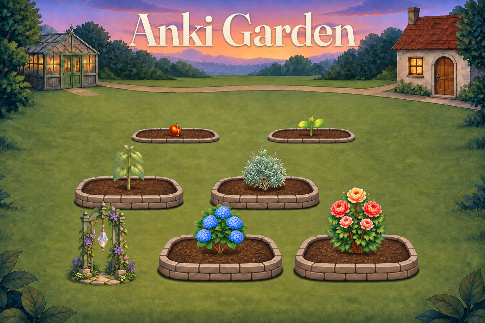
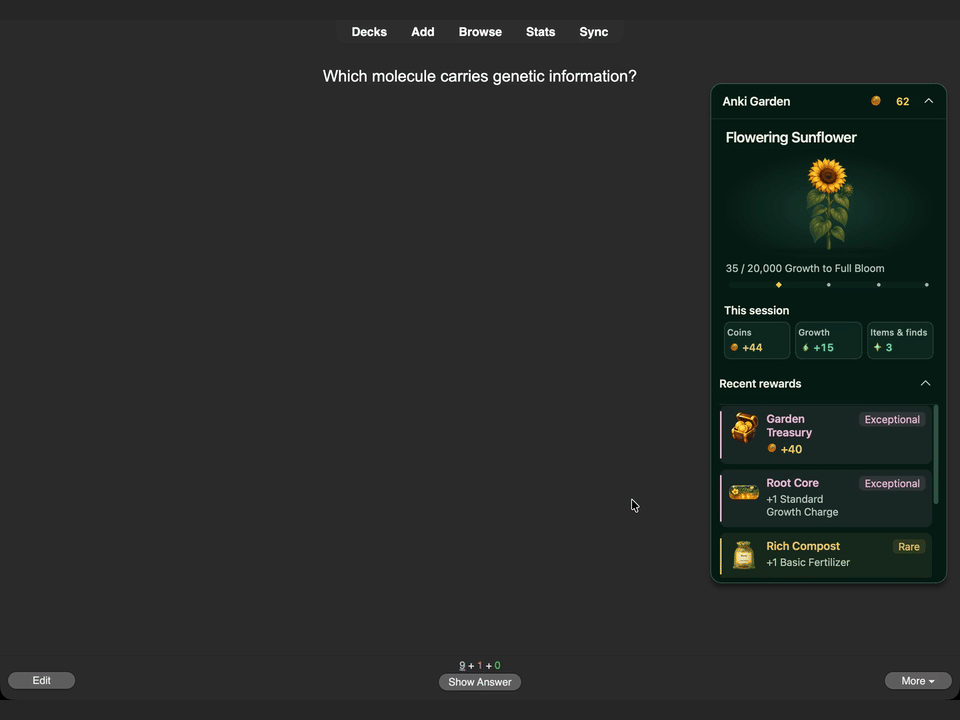

**Grow a garden while you study.**

Anki Garden is a free desktop Anki add-on that turns card answers into plant growth. Start with a seed, collect new plants, and customize your garden with scenery and decorations.

**No watering. No plant decay. Keep what you have earned when you take a break.**

## What you can do

- **Grow ten plant species** through six stages, from Seed to Full Bloom, and unlock more garden beds.
- **Collect and customize** with scenery, decorations, supplies, achievements, and Gardening Trophies.
- **Earn rewards while studying**, including Coins, Growth, and Garden Finds.
- **Choose how much you see.** Keep a compact progress tile in the reviewer or expand it for plant details, session totals, and recent rewards.

*Current reviewer showcase with prepared rare reward examples, not typical reward frequency.*

## Made to fit normal Anki study

Again, Hard, Good, and Easy give the same base Growth. Choose your answer according to your recall, not the garden.

Your nurtured plant receives Growth, and other unfinished planted plants receive Shared Growth. Fertilizer and Potions last for card answers rather than elapsed time. Streak achievements unlock permanent Growth bonuses; a broken streak does not remove the highest bonus you have already earned.

**Coins are in-game currency**, earned through studying and Garden rewards.

## Start your garden

1. Install using the add-on code below and restart Anki.
2. Select **Choose a plant** on Anki's home screen. Your first starter is free.
3. Place it in a bed and choose **Nurture**.
4. Study as usual. Return through **Open garden** or the reviewer panel.

Open **Progress → Activity** to view Study rewards and the **Finish all cards due today** milestone. Use Garden settings to reduce animations or change which panels and summaries appear.

## Compatibility and current limitations

**Preview testing:** Anki 26.08.1 on macOS and Windows 11 ARM (native ARM and emulated x64), at 100% application scaling. Final release acceptance is pending. Physical Intel/AMD Windows hardware and Linux remain unverified.

**Desktop only.** The Garden interface does not run inside AnkiMobile, AnkiDroid, or the AnkiWeb website. Garden inventory and settings do not synchronize between computers. Synced review history can earn rewards when it reaches desktop; compatibility with a particular sync workflow still depends on the tested build.

Stored Growth is saved but cannot be spent in this version. Compatibility with other add-ons may vary. The first study-history update can take longer with a large collection.

## Price, licensing, and development

**Price:** Free.  
**Source-code license:** [AGPL-3.0-or-later](https://www.gnu.org/licenses/agpl-3.0.html)  
**Artwork and third-party asset terms:** Project artwork: [CC BY 4.0](https://creativecommons.org/licenses/by/4.0/), to the extent of rights held by the project; third-party material retains its own terms.

Developed and maintained by **Caleb Meadows**. Development is substantially AI-assisted with Codex; I direct the project and am responsible for reviewing changes, release validation, and maintenance.

Artwork includes AI-generated assets. Third-party assets retain their own terms.

Questions and bug reports are welcome in the comments on this listing.

**Source and support:** [GitHub](https://github.com/caleblee789/Anki-Gardening).